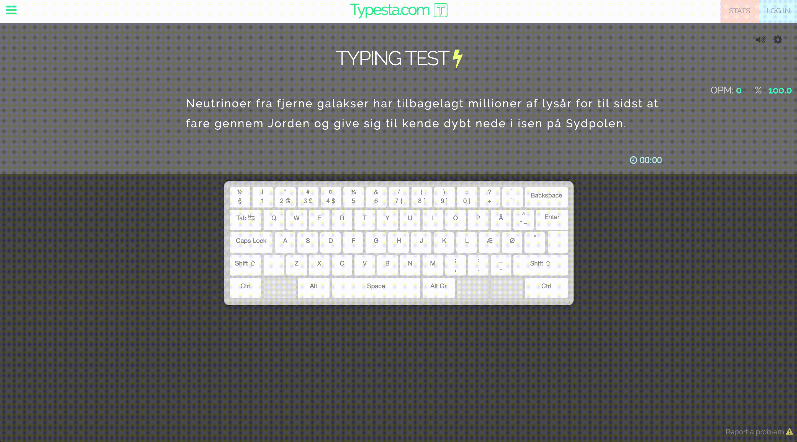

Typesta
=======

Typesta is a small vanilla JS app I started to learn and practice Javascript,
while also improving my touch typing skills :-)

### Demonstration

## Build
1. Install dependencies: `$ npm install`
2. Build with: `$ gulp`
3. Start php-server from `./dist` e.g. with `$ php -S localhost:9000`

